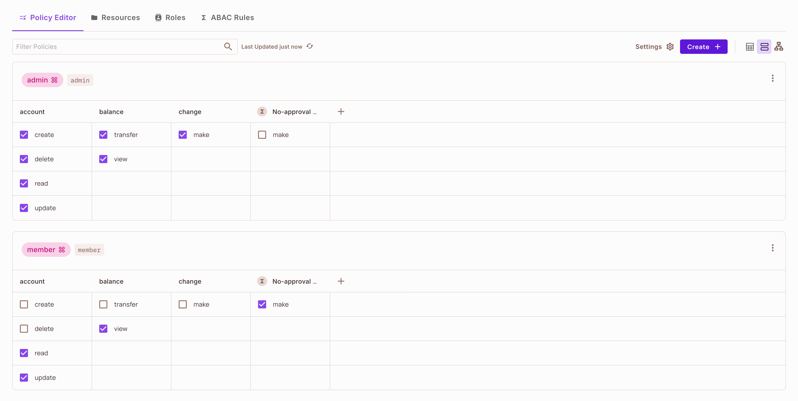
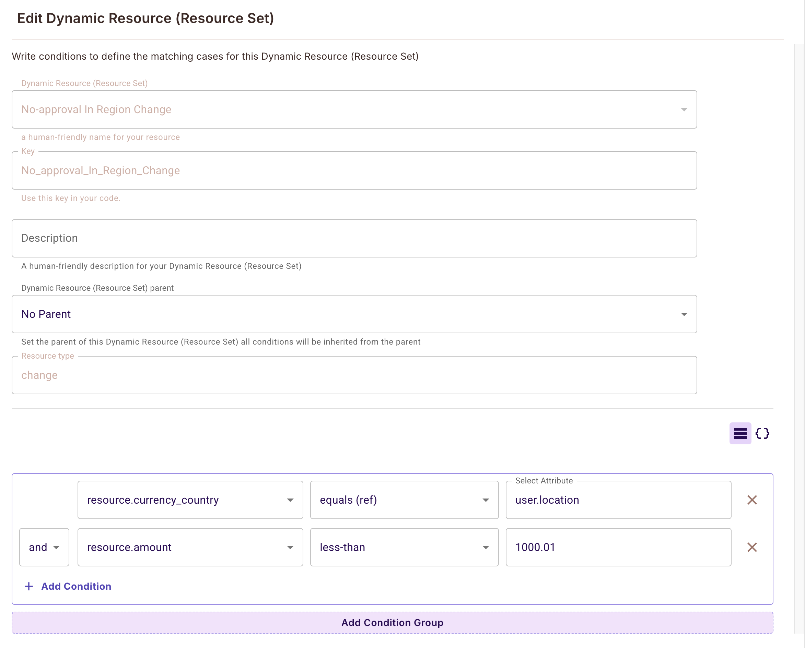

## Introduction

This tutorial shows how to add both role-based (RBAC) and attribute-based (ABAC) fine-grained authorization to your existing Next.js + FusionAuth application using Permit.io. We'll demonstrate:

- Role-Based Access Control (RBAC) with FusionAuth roles: controlling access based on user roles such as admin or member
- Attribute-Based Access Control (ABAC) for contextual permissions: controlling access based on user and resource attributes (e.g., country, amount)
- Protected routes and API endpoints
- Dynamic UI rendering based on user permissions

**RBAC** (Role-Based Access Control) lets you assign permissions to users based on their roles (e.g., admin, member). **ABAC** (Attribute-Based Access Control) allows you to define rules based on attributes of users and resources (e.g., only allow transactions under $1000 in the user's country). Combining both provides powerful, flexible security.

## What We're Building 

We're enhancing an existing Next.js application with FusionAuth authentication by adding a sophisticated authorization layer using Permit.io. This combination allows us to:
1. Keep our existing authentication system (FusionAuth)
2. Add granular authorization controls using both RBAC and ABAC (Permit.io)
3. Create a more secure and flexible access control system

## Prerequisites

- A working Next.js application with FusionAuth integration (see [FusionAuth Next.js Quickstart](https://github.com/FusionAuth/fusionauth-quickstart-javascript-nextjs-web?tab=readme-ov-file#example-nextjs-application))
- A Permit.io account (sign up at [Permit.io](https://permit.io))
- Your FusionAuth roles configured (admin, member)

## Step 1: Set Up Permit.io

**What We're Doing Here:**
We're setting up Permit.io as our authorization service. This step establishes the foundation for our fine-grained access control system by:
- Creating a dedicated project for our application
- Securing our API key for authentication
- Preparing for the authorization model we'll define next

1. Create a new project in the Permit.io dashboard
2. Add your Permit.io API key to `.env.local`:
```
PERMIT_API_KEY=your_permit_api_key_here
```

## Step 2: Define Your Authorization Model

**What We're Setting Up:**
We're creating a comprehensive authorization model that combines:
- **RBAC:** What resources users can access (accounts, balances, changes) and what actions they can perform, based on their assigned roles (admin, member)
- **ABAC:** Attribute-based rules that further restrict or allow actions based on user or resource attributes (e.g., country, transaction amount)

This dual approach allows you to start with simple role-based permissions and then add more granular, context-aware rules as needed.

In the Permit.io dashboard:

1. Define resources and actions:
   - account: create, read, update, delete
   - balance: transfer, view
   - change: make

2. Configure permissions:
   - **admin** can:
     - account: create, read, update, delete
     - balance: transfer, view
     - change: make
   - **member** can:
     - account: read, update
     - balance: view
     - change: make


*Permit.io dashboard showing the overall permissions and roles configuration.*

3. Add ABAC rules (example):
   - Only allow users to make a change if the resource's country matches the user's location and the amount is less than $1000.01.

## Step 3: Integration Overview

**What We're Implementing:**
We're building a complete authorization system that:
1. **Keeps User Data in Sync:**
   - Automatically maintains user information between FusionAuth and Permit.io
   - Preserves user roles and attributes
   - Ensures consistent authorization decisions

2. **Implements a Multi-layer Authorization Strategy:**
   - Server-side checks for security-critical operations
   - Client-side checks for responsive UI
   - Context-aware decisions based on user attributes

## Step 4: Implementation Details

### User Synchronization

**What This Code Does:**
This section implements the user synchronization logic that:
- Extracts user roles from FusionAuth's JWT tokens
- Maintains user data consistency across systems
- Enables attribute-based access control with user context

After authentication, users are automatically synced with Permit.io:

```typescript
// Example of user sync with roles from FusionAuth JWT
const syncUser = async (user: User, country?: string, accessToken?: string) => {
  // Extract roles from FusionAuth JWT
  const roles = extractRolesFromJWT(accessToken);
  
  // Sync user with Permit.io
  await permit.api.syncUser({
    key: user.email,
    email: user.email,
    roles: roles,
    attributes: {
      location: country
    }
  });
};
```

### Fine-grained Authorization Examples

**What These Examples Show:**
We're demonstrating three key aspects of our authorization system:
1. **Contextual Decision Making:**
   - How to make authorization decisions based on transaction context
   - Using country and amount attributes for access control

2. **Server-side Security:**
   - How to protect sensitive operations
   - Implementing secure permission checks

3. **Dynamic UI Adaptation:**
   - How to create responsive interfaces based on permissions
   - Implementing client-side permission checks

1. **Transaction Management with Country-based Rules**:
```typescript
// Example of checking transaction permissions with country context
const canMakeTransaction = await permit.check(
  user.email,
  'make',
  'change',
  {
    country: 'US',
    amount: 100,
    currency: 'USD'
  }
);
```


*Example: Permit.io dynamic resource set configuration for ABAC, matching user location and transaction amount.*

2. **Account Balance Visibility**:
```typescript
// Server-side check for viewing account balance
const canViewBalance = await checkCurrentUserPermission('view', 'balance');
```

3. **UI Adaptation Based on Permissions**:
```typescript
// Client-side component showing/hiding features
const { isAllowed } = usePermit({
  action: 'make',
  resource: 'change'
});

// Only show management options if user has permission
{isAllowed && (
  <button onClick={handleMakeChange}>
    Make Change
  </button>
)}
```

## Step 5: Testing the Integration

**What We're Testing:**
We're verifying our complete authorization system by:
- Testing different user roles and their permissions
- Validating that UI elements adapt correctly
- Ensuring security controls work as expected

1. Start the application:
```bash
npm run dev
```

2. Test different user scenarios:
   - Login as a member (limited permissions)
   - Login as an admin (full permissions)
   - Notice how UI elements and available actions change based on permissions

## Additional Resources

- [Permit.io Documentation](https://docs.permit.io/)
- [FusionAuth Documentation](https://fusionauth.io/docs/)
- [Source Code Repository](https://github.com/permitio/fusionauth-quickstart-javascript-nextjs-web)

## TL;DR

Add fine-grained authorization to your Next.js + FusionAuth application:

1. Set up Permit.io for RBAC and ABAC
2. Integrate Permit.io with your existing Next.js app
3. Configure your authorization model
4. Test with different user roles and permissions 